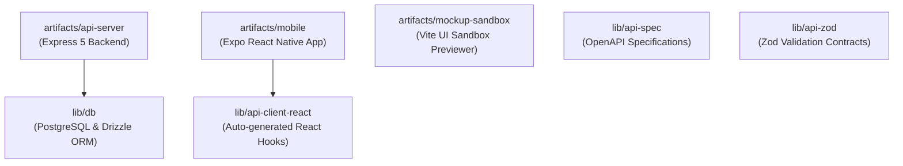

# 🎓 AEC Campus Enterprise OS — Setup & Run Guide

Welcome to the **Al-Ameen Engineering College (AEC) Campus Enterprise OS** developer guide. This repository is structured as a high-performance **pnpm monorepo** containing modular packages for the API server, database layer, shared specs, component sandbox, and a dual-locale Expo mobile application.

---

## 🏗️ Repository Architecture

This project is organized as a workspace monorepo consisting of:



* **`/lib` (Core Core libraries)**
  * [lib/db](file:///f:/New%20folder/Campus-Enterprise-main/lib/db) — PostgreSQL connection, schemas, and queries using Drizzle ORM.
  * [lib/api-spec](file:///f:/New%20folder/Campus-Enterprise-main/lib/api-spec) — OpenAPI schemas and codegen contracts.
  * [lib/api-zod](file:///f:/New%20folder/Campus-Enterprise-main/lib/api-zod) — Standardized validation schemas.
  * [lib/api-client-react](file:///f:/New%20folder/Campus-Enterprise-main/lib/api-client-react) — Auto-generated type-safe API hooks for React/Expo.
* **`/artifacts` (Runnable Applications)**
  * [artifacts/api-server](file:///f:/New%20folder/Campus-Enterprise-main/artifacts/api-server) — Express 5 backend API server.
  * [artifacts/mobile](file:///f:/New%20folder/Campus-Enterprise-main/artifacts/mobile) — React Native / Expo Go student, faculty, and administration portal.
  * [artifacts/mockup-sandbox](file:///f:/New%20folder/Campus-Enterprise-main/artifacts/mockup-sandbox) — Vite component preview engine for the development canvas.

---

## 🛠️ Step 1: Initial Setup & Prerequisites

Before starting, ensure you have the following environments configured on your system:
* **Node.js**: `v24` or higher.
* **Package Manager**: **`pnpm`** (Only-allow is active in workspaces).

### 1. Install Workspace Dependencies
From the root directory, run the pnpm installer:
```bash
pnpm install
```

### 2. Configure Environment Variables
Create a `.env` file in the root directory (or ensure the environment variables are active):
```env
# Required for lib/db (Drizzle PostgreSQL)
DATABASE_URL=postgresql://<user>:<password>@<host>:<port>/<dbname>
```

> [!IMPORTANT]
> Make sure your PostgreSQL server is active and accessible before pushing schema definitions.

### 3. Push Database Schema Definitions
Initialize and synchronize database schemas with your active PostgreSQL cluster:
```bash
pnpm --filter @workspace/db run push
```
*(If you need to force-override schema shifts, use `pnpm --filter @workspace/db run push-force`)*

---

## 🚀 Step 2: Running the Services

The services inside this monorepo can be run independently using workspace filters.

### 1. Run the Backend API Server
Start the development Express API server (Runs on port `5000` by default):
```bash
pnpm --filter @workspace/api-server run dev
```

### 2. Run the Mockup Sandbox UI Previewer
Start the Vite development previewer for rendering localized UI mockups:
```bash
pnpm --filter @workspace/mockup-sandbox run dev
```

### 3. Run the Mobile App (Expo Go)
Launch the Metro Bundler to preview the mobile application. This supports direct debugging in emulator screens or physical devices via the Expo Go app:
```bash
pnpm --filter @workspace/mobile run dev
```

---

## 🏗️ Step 3: Compiling & Bundling

### 1. Run TypeScript Checks
Verify syntax, compiler options, and imports across all workspace projects:
```bash
pnpm run typecheck
```

### 2. Build All Packages (Production Bundles)
Verify clean builds, generate type definitions, compile ES modules, and bundle packages:
```bash
pnpm run build
```

---

## ⚙️ Advanced Developer Commands

* **API Client Code Generation**:
  If you modify the OpenAPI specification files under `lib/api-spec` and want to regenerate the API fetch hooks and models for the Expo React app, run:
  ```bash
  pnpm --filter @workspace/api-spec run codegen
  ```

---

> [!TIP]
> Keep your Node.js and dependencies up-to-date and run `pnpm typecheck` regularly during active paired programming sessions to prevent regression issues.
